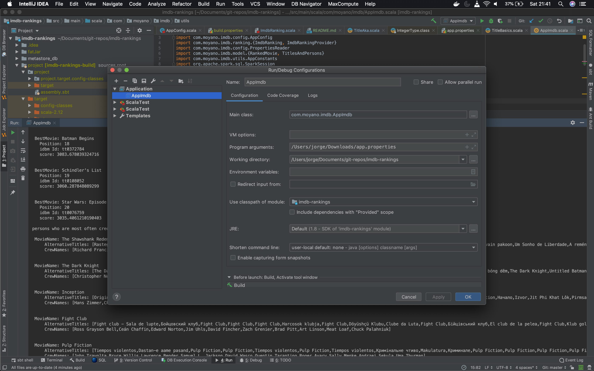
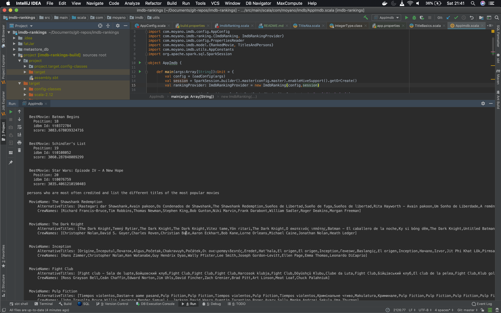

# IDBM Ranking tests

## Description
This demo application has two purposes:

    * Retrieve the top 20 movies with a minimum of 50 votes with the ranking determined by: 
    (numVotes/averageNumberOfVotes) * averageRating
    * For these 20 movies, list the persons who are most often credited and list the different titles of the 20 movies
    
## Configuration
   
The application expects a properties file with the following fields:

    * master: The spark master configuration
    * basePath: Path to the gz file (relative to the nodes if submitted to a cluster)
    * nameBasics: the name basic file ->name.basics.tsv.gz
    * titleAkas: the title akas file ->title.akas.tsv.gz
    * titleBasics: the title basic file->title.basics.tsv.gz
    * titleCrew: the title crew file->title.crew.tsv.gz
    * titleEpisode: the title episode file->title.episode.tsv.gz
    * titlePrincipal: the title principal file->title.principals.tsv.gz
    * ratings: the rating file->title.ratings.tsv.gz
    
## Execution
### Executing from IDE
It is possible to run the application directly from your IDE. For this you need to pass the path to the config file 
described above as a program argument. An example is shown below:


Producing the following results:



### Executing with spark-submit (Not implemented)
Due to the lack of time, the following functionality has not been tested. It is possible to create a fat jar using sbt 
by executing `sbt assembly`. After the fat jar is generated, you can run the application by executing:

```shell
./bin/spark-submit --class com.moyano.imdb.AppImdb \
  --master <master-url> \
  --deploy-mode cluster \
  --conf <key>=<value> \
  --files <config-file> \
  <application-jar> 
```

where `config-file` is the properties file described in the _Configuration_ section
